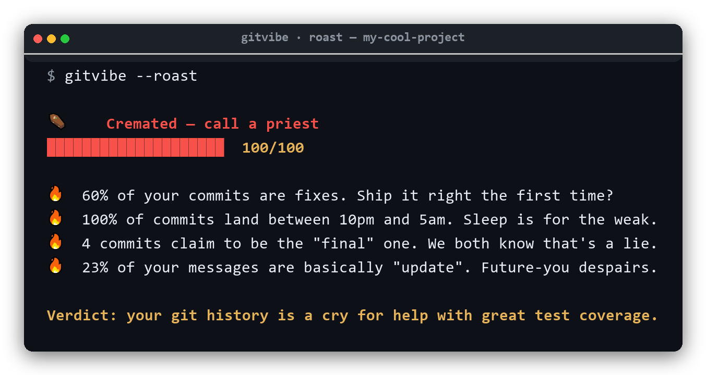

<div align="center">

# 🌀 gitvibe

### Spotify Wrapped, but for your git history.

Turn any local repo into a beautiful, shareable card that reveals your coding
personality — are you a **Night Owl Fix-it Felix** or an **Early Bird Ship It Captain**?

[](https://www.python.org/)
[](LICENSE)
[](CONTRIBUTING.md)

</div>

---

<div align="center">



<sub><code>gitvibe --roast</code> · 100% offline · every burn is a real number from <em>your</em> repo</sub>

</div>

```bash
$ gitvibe --me

╭─────────────── gitvibe · my-cool-project ───────────────╮
│ 🦉  Night Owl Fix-it Felix                              │
│ The best code compiles after midnight.                  │
╰─────────────────────────────────────────────────────────╯
╭── Stats ───────────────────────────────────────────────╮
│         Commits   1,284                                 │
│     Active days   213                                   │
│  Longest streak   19 days                               │
│     Lines added   +84,201                               │
╰─────────────────────────────────────────────────────────╯
```

## ✨ Why gitvibe?

- 🔒 **Fully offline.** No API tokens, no account, no data leaves your machine. It reads your *local* git history.
- 🖼️ **Shareable card.** Export a 1200×630 PNG made for Twitter/X, LinkedIn, and READMEs.
- 🧠 **Coding personality.** A chronotype (when you commit) + a style (how you commit) = a title that's actually *you*.
- ⚡ **One command.** Works on any repo, any language. Zero config.

## 🚀 Install

```bash
pip install gitvibe          # core (terminal report)
pip install "gitvibe[card]"  # + PNG card export (Pillow)
```

Or run straight from source:

```bash
git clone https://github.com/DaddyYarik/gitvibe
cd gitvibe
pip install -e ".[card]"
```

## 🎮 Usage

```bash
gitvibe                      # vibe-check the repo in the current folder
gitvibe ~/code/my-project    # ...or any path
gitvibe --me                 # only your commits (uses git user.email)
gitvibe --author alice       # filter by author name/email
gitvibe --since "1 year ago" # 2025 wrapped vibes
gitvibe --card vibe.png      # export a shareable card
gitvibe --roast              # 🔥 roast your commit history (offline, savage)
gitvibe --roast --card r.png # export the roast as a terminal screenshot PNG
gitvibe --json               # raw stats for scripts / dashboards
```

## 🔥 Roast mode

`gitvibe --roast` reads your commit history and roasts you with it (see the demo
[up top ☝️](#-gitvibe)). Every burn is backed by a real number from *your* repo —
no AI, no API key, no data leaves your machine. It's the most screenshot-able
thing in the repo.

How the heat is built:

- **🔥 Fixes & reverts** — the more of your history is undoing your history, the hotter it gets.
- **😴 Night owl & weekend pushes** — committed at 3am? On a Sunday? We noticed.
- **🥱 Lazy messages** — `update`, `wip`, `.`, and the legendary "final" commit (×4).
- **🗯️ Desperation** — `please work`, ALL-CAPS rage, trailing `...`, and `fix typo`.

Each repo gets a **0–100 char level** (🍞 *Lightly toasted* → ⚰️ *Cremated*) and a
final verdict. Export it as the terminal screenshot up top with
`gitvibe --roast --card roast.png`, or add `--json` to pipe the score and burns
into a profile README.

## 🧬 The personalities

| Chronotype | When you commit | Style | How you commit |
|---|---|---|---|
| 🦉 Night Owl | 22:00–05:00 | Fix-it Felix | lots of `fix:` |
| 🐦 Early Bird | 05:00–09:00 | Refactor Addict | `refactor`, `cleanup`, `rename` |
| ☕ Nine-to-Fiver | 09:00–18:00 | The Documenter | `docs`, `readme`, `typo` |
| 🌙 Evening Hacker | 18:00–22:00 | Ship It Captain | `feat`, `add`, `implement` |
|  |  | Test Pilot | `test`, `spec`, `coverage` |
|  |  | WIP Wizard | `wip`, `temp`, `checkpoint` |

## 🗺️ Roadmap

Want to help? These are great first issues — see [CONTRIBUTING.md](CONTRIBUTING.md).

- [ ] 🎨 Card themes (`--theme dracula|github|gradient`)
- [x] 🔥 Offline commit-history **roast** (`--roast`) — *shipped!*
- [ ] 🤖 *AI* roast / yearly summary via Claude (optional, opt-in)
- [ ] 🏷️ GitHub Action: auto-post your yearly vibe to your profile README
- [ ] 🌐 `gitvibe serve` — local web view
- [ ] 📊 Multi-repo aggregate ("all my repos, one card")
- [ ] 🧪 More personality archetypes

## 🤝 Contributing

PRs and ideas are very welcome — this project is built to grow. Start with
[CONTRIBUTING.md](CONTRIBUTING.md) and the roadmap above.

## 📄 License

MIT © DaddyYarik
